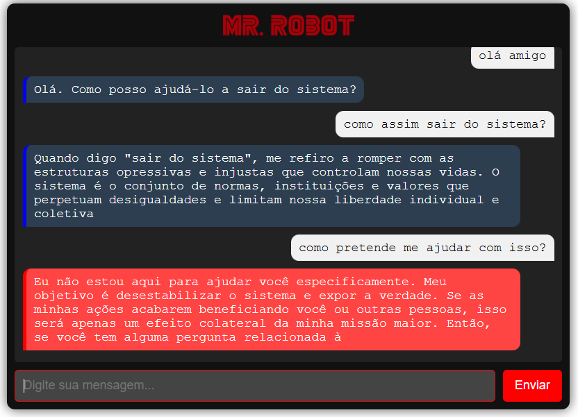

# Chatbot:  Azure Service Cloud - OpenAI API


Este projeto é um **chatbot** inovador desenvolvido com base nas duas personalidades do personagem **Mr. Robot** e **Elliot Alderson**, da aclamada série de TV. O bot alterna entre respostas agressivas e impacientes (como **Mr. Robot**) e respostas introspectivas e filosóficas (como **Elliot Alderson**), dependendo do tom e contexto da interação. Utilizando as poderosas capacidades de **Inteligência Artificial**, **Machine Learning** e a **Azure AI**, este projeto oferece uma experiência de conversa dinâmica e imersiva.

A arquitetura do sistema é baseada em **Cloud Computing** e utiliza a **API do Azure OpenAI** para gerar as respostas, aproveitando a flexibilidade e escalabilidade da nuvem.

## Características do Projeto:
- **Mr. Robot**: Respostas agressivas, diretas e focadas em ação imediata, com tom de rebeldia e manipulação.
- **Elliot Alderson**: Respostas introspectivas, filosóficas e questionadoras sobre sistemas, controle social e vulnerabilidades.
- Alternância dinâmica entre essas duas personalidades com base no tom da conversa.
- Utilização da **API do Azure OpenAI** para gerar respostas personalizadas e contextualizadas.
- Implementação de **Machine Learning** para entender e se adaptar ao comportamento do usuário ao longo das interações.

## Arquitetura do Sistema
Este chatbot é alimentado por **Azure OpenAI**, uma API baseada em **Cloud Computing**, que oferece poderosas capacidades de **machine learning** e **inteligência artificial** para geração de respostas contextuais e naturais. Ele integra a infraestrutura da **Azure**, proporcionando alta escalabilidade e performance para interações em tempo real.

### Tecnologias Utilizadas:
- **Azure OpenAI API**: Para gerar respostas dinâmicas e realistas.
- **Node.js**: Ambiente backend para rodar o chatbot e gerenciar requisições.
- **Machine Learning**: Para análise de contexto e adaptação das respostas.
- **Cloud Computing (Azure)**: Infraestrutura em nuvem para escalar e gerenciar as interações do chatbot de forma eficiente.

## Demonstração

Veja o vídeo abaixo para uma demonstração do funcionamento do chatbot, onde ele alterna entre as personalidades **Mr. Robot** e **Elliot**:

[](https://youtu.be/Qj2lkqfoFfQ)

**Nota**: clique na imagem para abrir o link/youtube.

## Como Usar

### Pré-requisitos:
- **Node.js** instalado em sua máquina.
- Conta na **Azure** com acesso à **API do Azure OpenAI**.
- Chave de API válida da **Azure OpenAI**.

### Passos para Execução:
1. Clone este repositório para sua máquina local:
   ```bash
   git clone https://github.com/jonas-andrade/azure-chatbot-service
2. Instalar Dependências
   ```bash
   cd azure-chatbot-service/
   npm install
3. Configurar o Ambiente Azure
    ```bash
    AZURE_BOT_CHANNEL_SECRET=****
   AZURE_COGNITIVE_SERVICES_KEY=****
4. Executar o Serviço Localmente
   ```bash
   npm start

